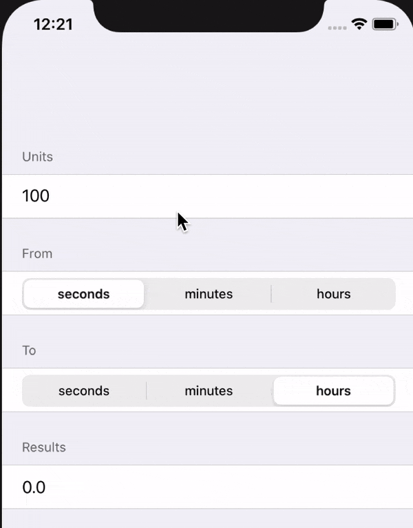

<!--  -->

# Measures

It's time units converter ios app built using SwiftUI. It's from [project 1](https://www.hackingwithswift.com/100/swiftui/19) from day 19 of the 100 days of swiftUI series by @twostraws.

